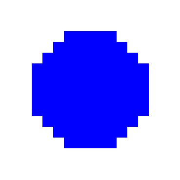
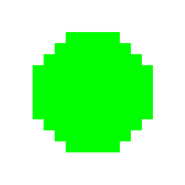

# Button Generator

Simple script to generate image of simplify 'caps' of different color. It will also generate image of 'invalid' caps, creating a dataSet of valid and invalid caps for a futur AI project.

For now, the image and caps size are hardcoded.

## Valid caps (OK)





## Not valid caps (NOK)

## Usage

At the top of the file you can change some constant to fit your needs.

```
OK = 100  #number of OK image cap
NOK = 100   #number of NOK image cap
COLOR = ["#FF0000","#0000FF","#00FF00"] #Choice of colors
OK_PATH = f'ButtonGenerator/OK' #Your folder path for the OK image
NOK_PATH = f'ButtonGenerator/NOK'   #Your folder path for the NOK image
```

