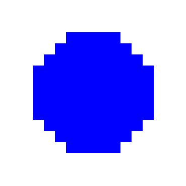
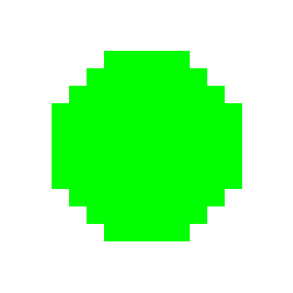
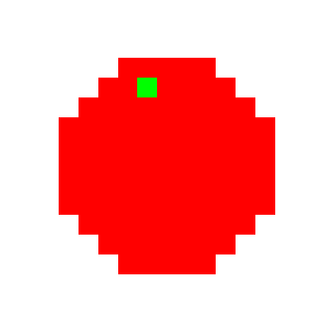
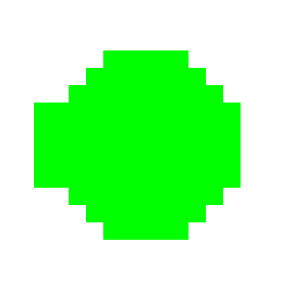
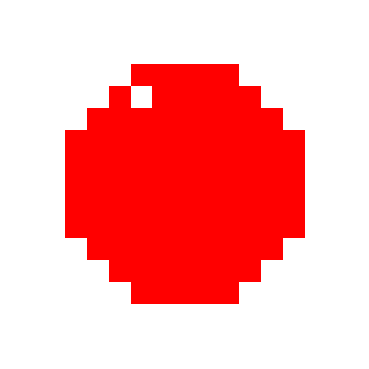
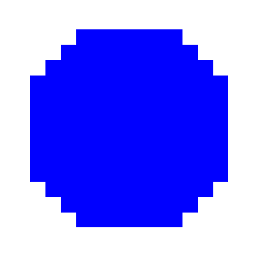

# Cap Generator

Simple script to generate image of simplify 'caps' of different color. It will also generate image of 'invalid' caps, creating a dataSet of valid and invalid caps for a futur AI project.

For now, the image and caps size are hardcoded.

The program generate folder inside of the parent one if you dont change the path in the code.

## Valid caps (OK)





## Not valid caps (NOK)
The following section have exemples of not valid caps.
### Color problem
This cap has extra color.

### Curve problem
This cap left curve is too large.

### Matter problem
This cap is missing some material.

### Size problem
This cap is too big.

## Usage

At the top of the file you can change some constant to fit your needs.

```
GENERATE_IMAGE = True
OK = 100 
NOK = 100
COLOR = ["#FF0000","#0000FF","#00FF00"]
OK_PATH = f'CapGenerator/OK' 
NOK_PATH = f'CapGenerator/NOK'
```
- GENERATE_IMAGE : If true will generate image, if false will only show the plot
- OK : Number of OK image cap
- NOK : Number of NOK image cap
- COLOR : Choice of colors
- OK_PATH : Your folder path for the OK image
- NOK_PATH : Your folder path for the NOK image
